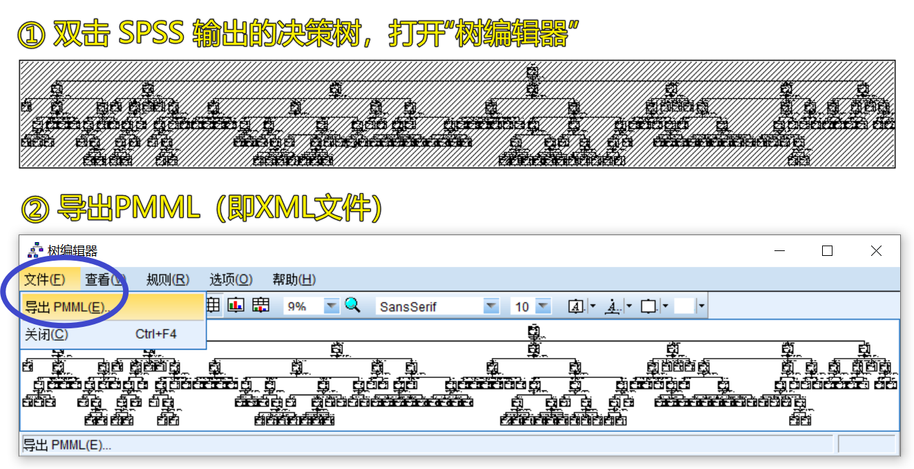

# 可视化 SPSS 决策树模型导出的XML文件

## 一、背景

在使用 SPSS 的决策树做分析时，如果树模型比较复杂，即便编辑调整后，其结果依然**不方便阅读**，如使用“波士顿房价”数据进行测试时，结果如下图所示。



为解决上述问题，本程序包可以提取决策树信息，并将之可视化为 HTML 文件，更**方便阅读**，如下图所示，在 HTML 中提供了以下三种功能：

- ① 自由设置剪枝阈值。
- ② 鼠标指向节点，显著节点信息与分类条件。
- ③ 点击节点，保存节点信息与分类条件，并标记被点击的节点。

测试数据与导出结果存放于目录 `./data_for_testing` 中。


## 二、使用示例

### 2.1 波士顿房价（回归树）

```python
# 导入模块
from spss_tree_visualization import extract_and_visualize as et

# 波士顿房价（回归树）

## 导入测试 XML 文件
with open('./data_for_testing/boston_house_prices.xml', 'r', encoding='utf-8') as fo:
    xml_c = fo.read()

## 提取决策树信息，并设置标题和颜色
e = et.Extract(
    xml_data=xml_c,
    title='SPSS决策树可视化示例 - 波士顿房价',
    sub_title='回归树',
    color_0='#f1faee',  # 默认值 #f1faee
    color_1='#0077b6'   # 默认值 #0077b6
)

## 导出决策树信息至 JSON 文件
e.save_json('data_for_testing/boston_house_prices__output.json')
## 导出可视化结果至 HTML 文件
e.save_html('data_for_testing/boston_house_prices__output.html')
```

### 2.2 鸢尾花（分类树）

```python
# 导入模块
from spss_tree_visualization import extract_and_visualize as et

# 鸢尾花（分类树）

## 导入测试 XML 文件
with open('./data_for_testing/iris.xml', 'r', encoding='utf-8') as fo:
    xml_b = fo.read()

## 提取决策树信息，并设置标题和颜色
e = et.Extract(
    xml_data=xml_b,
    title='SPSS决策树可视化示例-鸢尾花分类',
    sub_title='分类树',
    color_0='#fefae0',  # 默认值 #f1faee
    color_1='#1d3557'   # 默认值 #0077b6
)

## 导出决策树信息至 JSON 文件
e.save_json('data_for_testing/iris__output.json')
## 导出可视化结果至 HTML 文件
e.save_html('data_for_testing/iris__output.html')
```

## 附录 SPSS 决策树的 XML 文件结构

在 SPSS 决策树导出的 XML 文件中，主要结构如下：

```
* Header（SPSS信息）
* DataDictionary（字段信息）
* TreeModel（树模型信息）
  * Extension（扩展，头部）
    * X-risk
    * X-seOfRisk
  * Extension（扩展，尾部）
    * X-TreeModel
      * X-Priors
  * MiningSchema（挖掘概况）
    * MiningField（使用的字段）
  * ModelStats（模型统计）
    * UnivariateStats...（单变量统计）
  * Node（节点树）
    * Extension
      * X-Node

        * X-NodeStats（仅对分类型，有P值、卡方值、自由度）
        * X-RegInfo（仅对连续型，有均值和标准差）
    * CompoundPredicate（拆分条件）
    * ScoreDistribution...（该节点得分分布：分类型为）
    * Node...（子节点）
```

